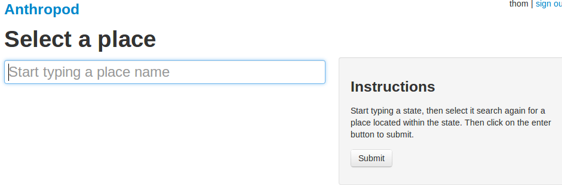
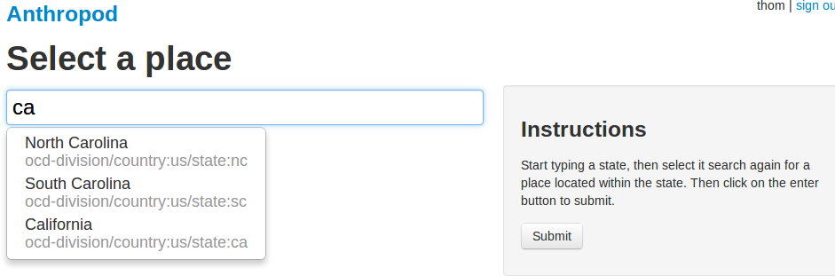
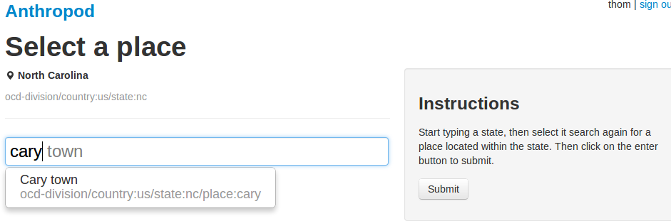
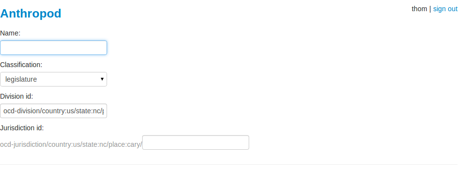
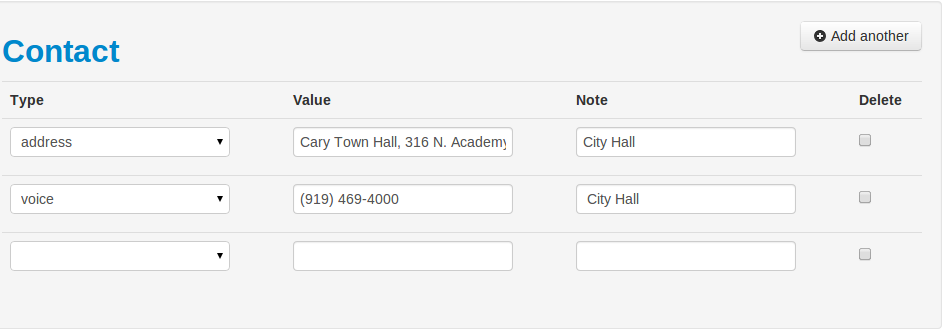

Creating a New Organization
===================================

Creating a new organization involves two steps. First, we need to choose a geographic division that best matches the scope of the organization's jurisdiction. Second, we enter the organizations data, and BOOM! We have a new organization in the database.

Select a Place
++++++++++++++++++++++++

To create a new organization, navigate to the anthropod home page and click on the button to create a new organization. The page will prompt you to select a place to associate with the new organization. Organizations are related to geographic divisions, which form a hierarchy.

This page enables you to drill down to the correct place. For example, if you need to add an organization for the town council of Cary, North Carolina, you could first search for "carolina" and select it from the results.

Once you select North Carolina, a second search box will appear. This box allows you to search all the divisions directly below North Carolina in the hierarchy. Now you can enter "Cary" to search for the town of Cary.

Now we have located the political division we need to associate the Cary Town Council with, so hit the submit button. The site will display a list of all the organizations currently associated with the selected place. If the city council for Cary, NC hasn't been created yet, hit the button to create a new organization.

.. image:: images/create_org_button.png
  :align: center
  :width: 75%

Enter the Organization's Details
+++++++++++++++++++++++++++++++++

Now we can go ahead and enter the organization's information into the system. First, choose a name for the new organization. Using the full name of the organization, "Cary Town Council." Next, choose the organization's classification from the dropdown menu. In the case of city and town councils, the classification type will be "legislature."  The third box, "division_id" is prefilled with the id of the geographic division we selected.

Next we need to select the "jurisdiction_id," which is a string of characters to identify this organization within it's geographic division. By convention, in the case of a city council, we'll simply type the word "council" into the box.

Enter the Organization's Posts
++++++++++++++++++++++++++++++++++

Now that we have entered the basic information for the new organization, next we'll add the posts available within this organization. In the case of a town council or other legislature, this typically means entering one "post" to represent each electoral district. Posts are used to relate membership objects to positions within an organization, so this data will be important later when it's time to add members to the organization.

Post Fields
---------------

Each post has the follwing three fields:

ID
  The post is the human-readable name of the post, like "District 9"
Role
  The post role is either "member," or "chair" [XXX: or something else?]
Number of Seats
  Some electoral districts can elect more than one representative. Enter than number here (usually just "1").

For the Cary Town Council, the posts will look like this:

.. image:: images/create_org_form_posts.png
  :align: center
  :width: 75%

Enter a Source URL
+++++++++++++++++++++++++

Enter in the urls you used to locate the above information. Use the official website of the organization if possible. The note field is optional.

.. image:: images/create_org_form_sources.png
  :align: center
  :width: 75%

At this point, all the required fields have been supplied, so we can save the organization and move on. But adding contact information for the organization is both easy and worth the effort, so let's do that too.

Enter the Organization's Contact Details
+++++++++++++++++++++++++++++++++++++++++++++

Adding contact information is very straightforwarded: for each field, you select a field type, a value, and optionally add a note. This allows you to add multiple phone numbers, for example.

Dundy!
+++++++++++++++++++++++++++++++++

Hit save and now you can :ref:`anthro_add_members`.
